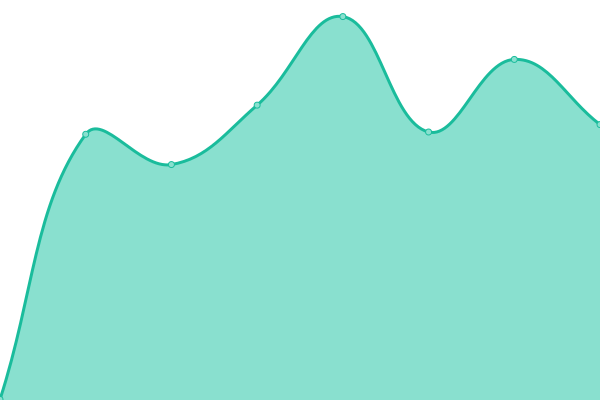
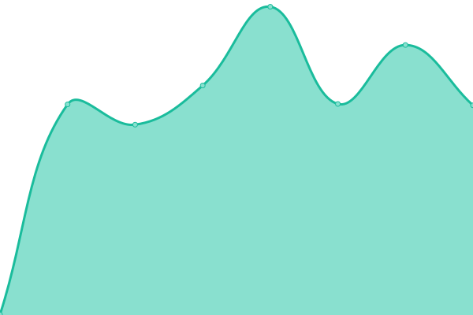
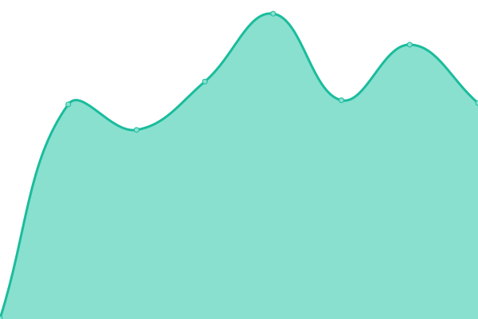
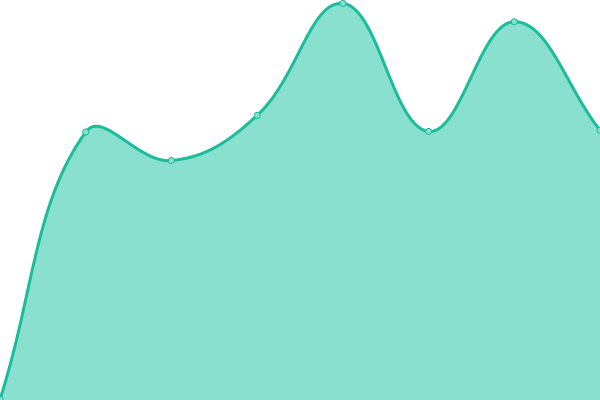
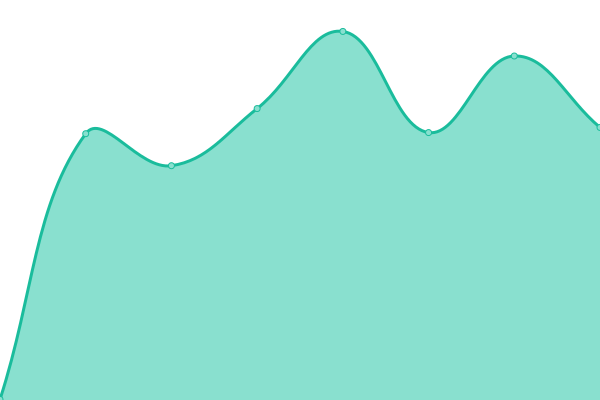
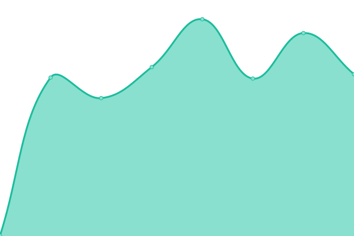

# [📈 Live Status](https://toll.github.io/status-page): <!--live status--> **🟩 All systems operational**

This repository contains the open-source uptime monitor and status page for [Toll](https://www.toll.no), powered by [Upptime](https://github.com/upptime/upptime).

For å slette, legge til, eller endre endepunkter som skal vises gå til [**Upptime sitt konfigurasjon**](https://github.com/toll/status-page/blob/master/.upptimerc.yml).

<!--start: status pages-->
<!-- This summary is generated by Upptime (https://github.com/upptime/upptime) -->
<!-- Do not edit this manually, your changes will be overwritten -->
<!-- prettier-ignore -->
| URL | Status | History | Response Time | Uptime |
| --- | ------ | ------- | ------------- | ------ |
|  [goodsdeclaration-declaration-document](https://api.toll.no/api/goodsdeclaration/document/v2/swagger-ui/index.html#/document-controller/create) | 🟩 Up | [goodsdeclaration-declaration-document.yml](https://github.com/toll/status-page/commits/HEAD/history/goodsdeclaration-declaration-document.yml) | 

 1077ms
     
 | 

<a href="https://toll.github.io/status-page/history/goodsdeclaration-declaration-document">100.00%</a>
    

|  [MO - movement-road-api-v2](https://api.toll.no/api/movement/road/v2/swagger-ui/index.html) | 🟩 Up | [mo-movement-road-api-v2.yml](https://github.com/toll/status-page/commits/HEAD/history/mo-movement-road-api-v2.yml) | 

 573ms
     
 | 

<a href="https://toll.github.io/status-page/history/mo-movement-road-api-v2">100.00%</a>
    

|  [MO - movement-road-query-api-v2](https://api.toll.no/api/movement/road/status/v2/swagger-ui/index.html) | 🟩 Up | [mo-movement-road-query-api-v2.yml](https://github.com/toll/status-page/commits/HEAD/history/mo-movement-road-query-api-v2.yml) | 

 561ms
     
 | 

<a href="https://toll.github.io/status-page/history/mo-movement-road-query-api-v2">100.00%</a>
    

|  [MO - movement-air-api](https://api.toll.no/api/movement/air/v1/swagger-ui/index.html) | 🟩 Up | [mo-movement-air-api.yml](https://github.com/toll/status-page/commits/HEAD/history/mo-movement-air-api.yml) | 

 563ms
     
 | 

<a href="https://toll.github.io/status-page/history/mo-movement-air-api">100.00%</a>
    

|  [MO - movement-air-query-api](https://api.toll.no/api/movement/air/status/v1/swagger-ui/index.html) | 🟩 Up | [mo-movement-air-query-api.yml](https://github.com/toll/status-page/commits/HEAD/history/mo-movement-air-query-api.yml) | 

 562ms
     
 | 

<a href="https://toll.github.io/status-page/history/mo-movement-air-query-api">100.00%</a>
    

|  [MO - movement-rail-api](https://api.toll.no/api/movement/rail/v1/swagger-ui/index.html) | 🟩 Up | [mo-movement-rail-api.yml](https://github.com/toll/status-page/commits/HEAD/history/mo-movement-rail-api.yml) | 

 572ms
     
 | 

<a href="https://toll.github.io/status-page/history/mo-movement-rail-api">100.00%</a>
    

|  [MO - movement-rail-query-api](https://api.toll.no/api/movement/rail/status/v1/swagger-ui/index.html) | 🟩 Up | [mo-movement-rail-query-api.yml](https://github.com/toll/status-page/commits/HEAD/history/mo-movement-rail-query-api.yml) | 

 570ms
     
 | 

<a href="https://toll.github.io/status-page/history/mo-movement-rail-query-api">100.00%</a>
    

|  [MO - movement-presentation-api](https://api.toll.no/api/movement/presentation/v1/swagger-ui/index.html) | 🟩 Up | [mo-movement-presentation-api.yml](https://github.com/toll/status-page/commits/HEAD/history/mo-movement-presentation-api.yml) | 

 561ms
     
 | 

<a href="https://toll.github.io/status-page/history/mo-movement-presentation-api">100.00%</a>
    

|  [MO - movement-routing-api](https://api.toll.no/api/movement/routing/v1/swagger-ui/index.html) | 🟩 Up | [mo-movement-routing-api.yml](https://github.com/toll/status-page/commits/HEAD/history/mo-movement-routing-api.yml) | 

 560ms
     
 | 

<a href="https://toll.github.io/status-page/history/mo-movement-routing-api">100.00%</a>
    

<!--end: status pages-->

## 📄 License

- Powered by: [Upptime](https://github.com/upptime/upptime)
- Code: [MIT](./LICENSE) © [Anand Chowdhary](https://anandchowdhary.com), supported by [Pabio](https://pabio.com)
- Data in the `./history` directory: [Open Database License](https://opendatacommons.org/licenses/odbl/1-0/)
